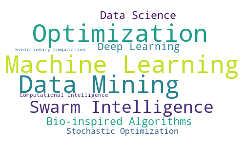

# Computer Scientist focused on...

  

 

# Technology Stack

 
 

My preferred tech stack in a more readable way:

<table width="100%">
<tr>
  <td width="20%">Languages:</td>
  <td>
      
      
      
  </td>
</tr>
<tr>
  <td width="20%">Development:</td>
  <td>
      
      
      
      
      
      
      
      
      
  </td>
</tr>
<tr>
  <td width="20%">DS, ML, DL:</td>
  <td>
      
      
      
      
      
      
      
  </td>
</tr>
<tr>
  <td width="20%">Collaboration:</td>
  <td>
      
      
      
      
      
      
  </td>
</tr>
<tr>
  <td width="20%">Tools / Misc:</td>
  <td>
      
      
      
      
      
      
      
  </td>
</tr>
</table>

#

See my [credits](credits.md).

